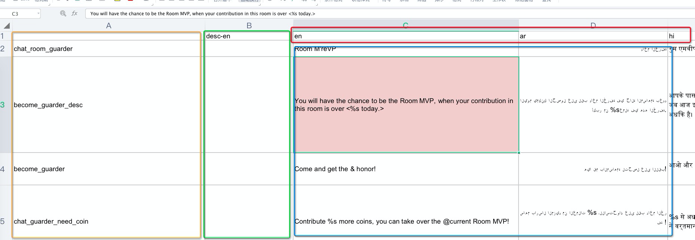

# 安卓多语言文案转换器

一键转换多语言文案，支持添加、修改功能。无需手动复制、整理格式。


## 使用说明

#### 使用方式：

```shell
java -jar copy_write_conveter.jar [excel文档路径] [输出的资源路径：eg.app/src/main/res]
```

#### Excel 格式

请参考 src/test/resources/copy_writer.xls 文件



1. 黄色部分为 key。

2. 绿色部分为文案描述，不会被转换。

3. 红色部分为语言缩写，此缩写将会变为文件夹名称：values-[语言缩写]

   >当语言为 en 是文件夹名字为：values
   >
   >当语言为 id 时文件夹名字为:    values-in

4. 蓝色部分为文案内容。程序会自动将特殊字符转为 html 标签

   

#### 打包方式：

```shell
./build.sh
```

输出结果将会在 `relese` 文件夹下

打包的时候使用了 proguard 对 jar 包进瘦身（3mb较少到1mb），但是没有开启 proguard 的优化和混淆功能，参见 proguard.pro 文件。

## 特殊说明

<font color = red>请使用 xls 格式的文档作为原始文件，并不是改了后缀名就可以的，一定要在 Excel 中另存为 xls 文件</font>，本程序使用 `net.sourceforge.jexcelap: jxl` 作为 Excel 的读取工具，但是此程序仅支持 xls 的文件（2003版本 Excel），如果是高版本的 Excel 文件，程序将报错

eg. 

```java
java -jar ./relese/copy_write_conveter.jar ./src/test/resources/copy_writer.xlsx ./src/test/resources
```


```shell
Exception in thread "main" jxl.read.biff.BiffException: Unable to recognize OLE stream
	at jxl.read.biff.CompoundFile.<init>(CompoundFile.java:116)
	at jxl.read.biff.File.<init>(File.java:127)
	at jxl.Workbook.getWorkbook(Workbook.java:221)
	at jxl.Workbook.getWorkbook(Workbook.java:198)
	at com.mrcd.Converter.convert(Converter.kt:33)
	at com.mrcd.MainKt$Companion.main(MainKt.kt:14)
	at com.mrcd.MainKt.main(MainKt.kt)
```

对于高版本的支持是有解决方案的：使用 [appche poi 的 XSSFWorkbook](https://poi.apache.org/apidocs/dev/org/apache/poi/xssf/usermodel/XSSFWorkbook.html) 替换 `net.sourceforge.jexcelap: jxl`，但 POI 功能强大且繁多，会使打出来的 java 很大(未优化前19M左右)，最终 jar 包都会跟随版本控制托管起来，这么大的包就一个简单的工作，得不偿失。

